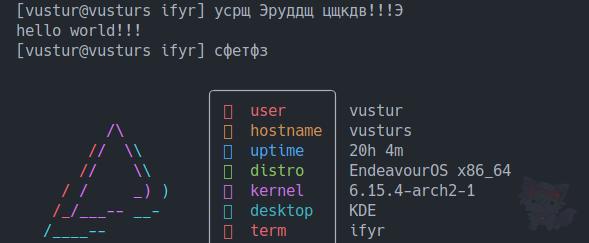

# Ифыр

Действительно идеальный шелл, после которого работа с терминалом не покажется прежней

Идея взята с [пше](https://пше.рф)

### Установка

1. Скачайте `ifyr` и `install.sh` со [страницы релизов](https://github.com/vustur/ifyr/releases/)
2. Поместите скачанные файлы в одну папку и запустите `install.sh`
3. Запустите `ifyr` или установите Ифыр как шелл по умолчанию - `chsh -s /usr/bin/ifyr`

### Сборка

1. Скачайте репозиторий
2. Запустите `compile.sh`

### Другое

Если у вас есть вопрос или предложения, напишите мне в [телеграм](https://t.me/vustur) (Алсо посмотрите мой [канал](https://t.me/vusturs) / [сайт](https://vustur.xyz) с моими проектами)
